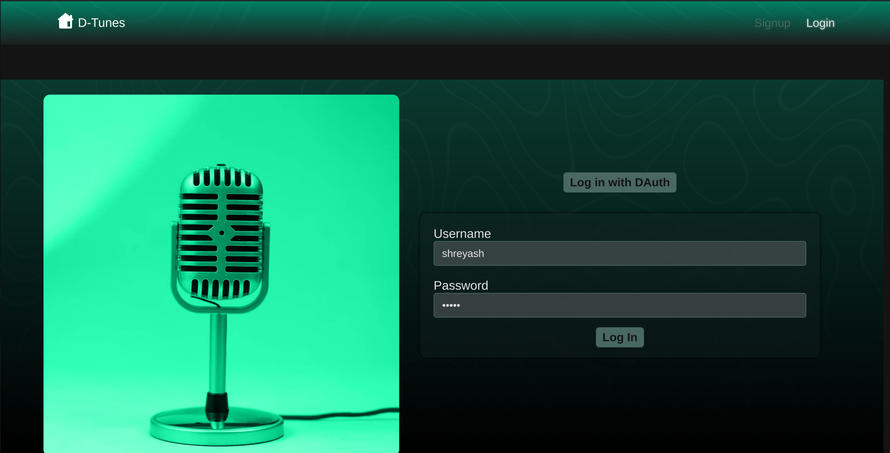
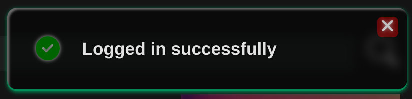
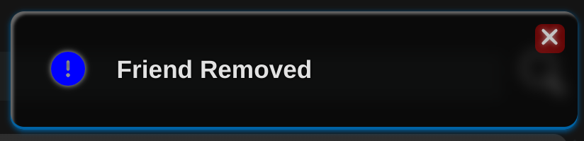
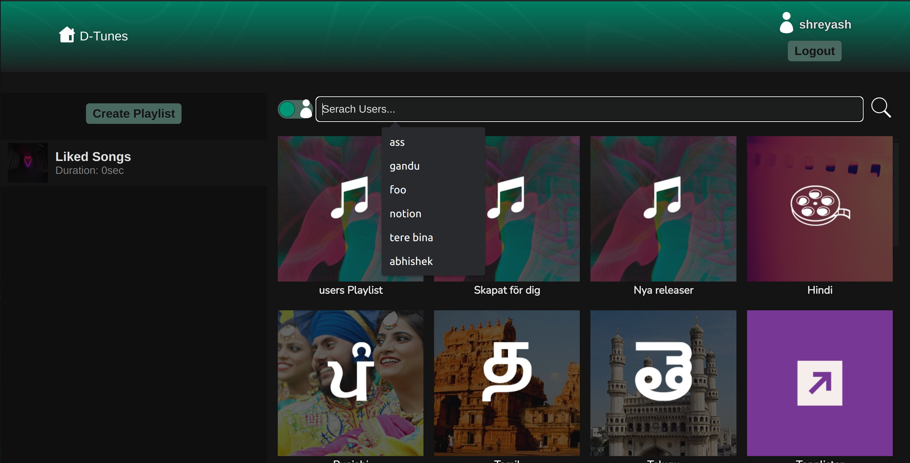
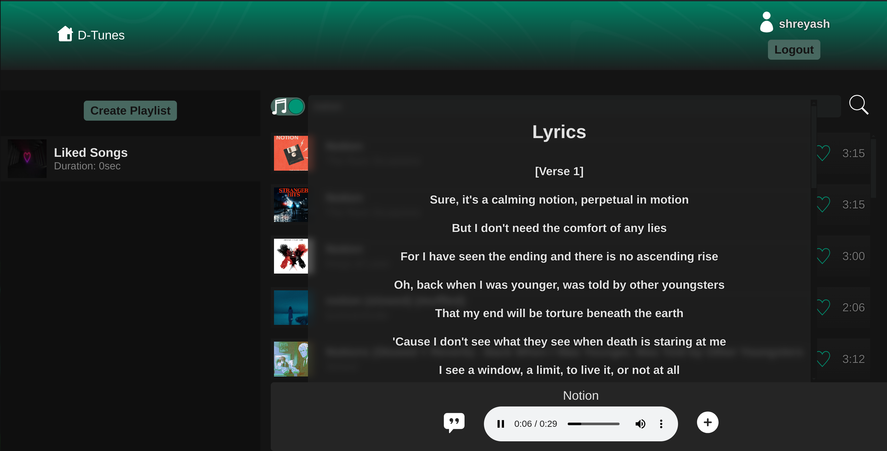
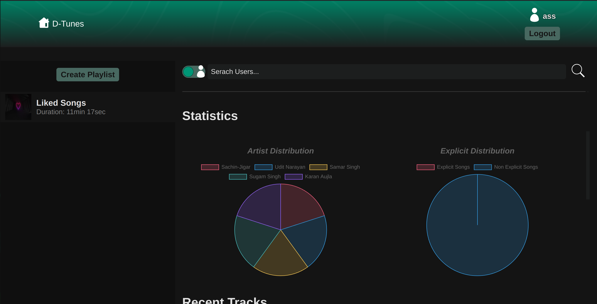

# DTunes

DTunes is a music streaming platform created to provide a seamless, ad-free music experience. It combines various APIs and technologies to deliver features like music streaming, playlist management, and social interactions.

## Features

- **User authentication: Register and log in**. 
- **Like Songs**
- **React Toasts with three states: 'success', 'warning' and 'failure' to notify the users of important updates**

  


- **Create and manage playlists with optional thumbnails.**
- **Create Public playlists visible to all user base.**
- **Sequential playback of playlist songs.**
- **Liked songs automatically available as a private playlist.**
- **Search and stream music from various sources.**
- **Upgrade to Artist accounts who can upload new music.**
- **Private playlists with total duration info.**
- **Friend requests and user search with a toggle.**
- **Display lyrics of currently playing song (using external APIs).** 
- **Display recently played songs of user's friends on their profile page.**
- **Track and visualize songs listened to in a specific time period, with percentage-wise distribution by artist, and explicity.** 
- **Mobile responsiveness for all screen sizes.**
- **Dynamic state change reflection (no need to keep refreshing the app to see the changes)**

## Technologies Used

- **Frontend**:  React,
   TypeScript,
   chartJS
- **Backend**:  Node.js,  Express,  Typescript
- **Database**: MongoDB
- **Authentication**:  JWT
- **APIs**:
  -  Spotify API for music
  -  Genius API for lyrics
- **Image and File Storage**:  Cloudinary

## Setup

### Prerequisites

- Node.js (v16 or later)
- MongoDB
- Spotify Developer Account
- Genius API Account
- Cloudinary Account

### Cloning the Repository

1. Clone the repository:

   ```bash
   git clone https://github.com/Datamaverik/D-Tunes
   cd D-Tunes
   ```

2. Install dependencies:

   ```bash
   npm install
   ```

3. Configuration
   1. Create a `.env` file in the `server` folder.
   2. Add the following environments varialbes to the `.env` file. Replace placeholders with your actual credentials:
   ```env
   MONGO_URI=your_mongodb_uri
   PORT=5000
   JWT_SECRET=your_jwt_secret
   FRONT_END_URL=http://localhost:3000
   SPOTIFY_CLIENT_ID=your_spotify_client_id
   SPOTIFY_CLIENT_SECRET=your_spotify_client_secret
   SPOTIFY_BASE_URL=https://api.spotify.com
   SPOTIFY_TOKEN_ENDPOINT=https://accounts.spotify.com/api/token
   TOKEN_ID=your_token_id
   CLOUDINARY_KEY=your_cloudinary_key
   CLOUDINARY_SECRET=your_cloudinary_secret
   CLOUD_NAME=your_cloudinary_cloud_name
   GENIUS_ACCESS_TOKEN=your_genius_access_token
   DATUTH_CLIENT_ID=your_dauth_client_id
   DAUTH_CLIENT_SECRET=your_dauth_client_secret
   ```
   3. Configure the Spotify, Genius and Cloudinary credentials:
      - **Spotify API:** Register your application to get the **`SPOTIFY_CLIENT_SECRET`**.
      - **Genius API:** Get your access token from the Genius API.
      - **Cloudinary:** Create an account to obtain your **`CLOUDINARY_KEY`** **`CLOUDINARY_SECRET`**, and **`CLOUD_NAME`**.
      - **DAuth:** Register your application to get **`DAUTH_CLIENT_ID`** and **`DAUTH_CLIENT_SECRET`**.

## Running the Application

1. Start the backend server:
   ```bash
   cd server
   npm start
   ```
2. Start the frontend application:
   ```bash
   cd client
   npm run dev
   ```

## Testing

- Ensure all environment variables are correctly set.
- Verify the functionality of each feature listed in the Features section.
